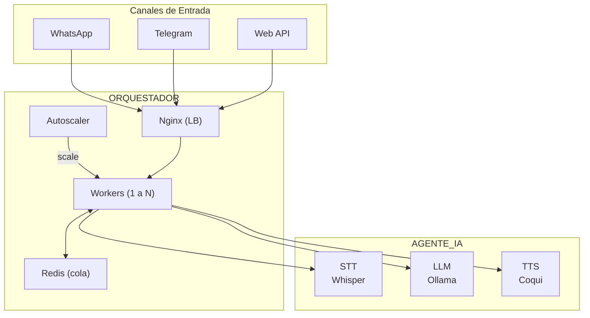
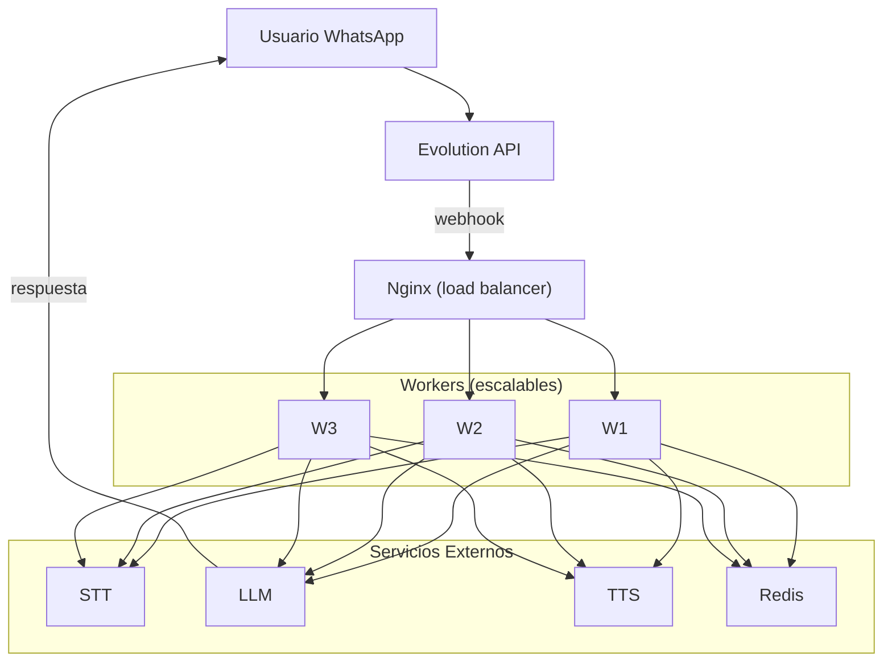
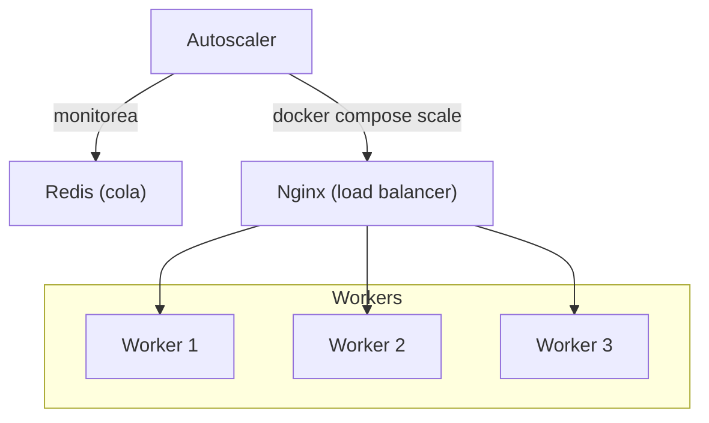

# Orquestador

Stack de orquestacion multicanal para servicios de IA.

## Arquitectura



## Servicios

| Servicio | Puerto | Descripcion |
|----------|--------|-------------|
| redis | 6379 | Cola de mensajes + historial |
| nginx | 8000 | Load balancer para workers |
| workers | - | API y procesamiento de mensajes (escalable) |
| autoscaler | - | Escala workers automaticamente |

## Instalacion

```bash
# 1. Configurar variables de entorno
cp .env.example .env
nano .env  # Configurar EVOLUTION_API_KEY

# 2. Ejecutar script de inicializacion
chmod +x init.sh
./init.sh
```

### Que hace init.sh

1. Carga variables de `.env`
2. Crea directorios de datos
3. Crea red `vpn-proxy` si no existe
4. Construye las imagenes Docker
5. Inicia los servicios (redis, workers)
6. Verifica conexion con servicios de IA
7. Muestra endpoints disponibles

## Endpoints

### Health Check

```bash
curl http://localhost:8000/health
```

### API de Chat (directa)

```bash
curl -X POST http://localhost:8000/api/chat \
  -H "Content-Type: application/json" \
  -d '{
    "message": "Hola, como estas?",
    "user_id": "user123",
    "want_audio": false
  }'
```

### Webhooks

| Canal | Endpoint | Estado |
|-------|----------|--------|
| WhatsApp | `/webhook/evolution` | Implementado |
| Telegram | `/webhook/telegram` | Pendiente |

## Configuracion del Webhook

El webhook debe configurarse en Evolution API (servidor 172.16.1.58) para enviar eventos a este orquestador.

### Desde Evolution Manager

1. Acceder a `http://172.16.1.58:8080/manager`
2. Entrar a la instancia de WhatsApp
3. Ir a **Webhooks** → Agregar:
   - **URL**: `http://172.16.1.57:8000/webhook/evolution`
   - **Events**: `MESSAGES_UPSERT`, `CONNECTION_UPDATE`

### Via API (ejecutar en servidor 172.16.1.58)

```bash
curl -X POST "http://localhost:8080/webhook/set/whatsapp_main" \
  -H "apikey: TU_API_KEY" \
  -H "Content-Type: application/json" \
  -d '{
    "webhook": {
      "enabled": true,
      "url": "http://172.16.1.57:8000/webhook/evolution",
      "webhookByEvents": true,
      "webhookBase64": true,
      "events": ["MESSAGES_UPSERT"]
    }
  }'
```

## Tipos de Mensaje Soportados

| Tipo | Procesamiento |
|------|---------------|
| Texto | LLM con historial de conversacion |
| Audio | STT -> LLM -> TTS (responde con audio) |
| Imagen | Vision LLM (analisis de imagen) |
| Documento | PDF/Office -> Vision LLM |

## Flujo de Mensajes



## Variables de Entorno

### Generales 

| Variable | Descripcion | Default |
|----------|-------------|---------|
| TZ | Zona horaria | America/Mexico_City |
| REDIS_PASSWORD | Password de Redis | orquestador123 |

### Servicios de IA

| Variable | Descripcion | Default |
|----------|-------------|---------|
| STT_URL | URL del servicio STT | http://agente_ia:8001 |
| TTS_URL | URL del servicio TTS | http://agente_ia:8002 |
| LLM_URL | URL del servicio LLM | http://agente_ia:11434 |
| LLM_CHAT_MODEL | Modelo para chat | qwen2.5:7b |
| LLM_IMG_MODEL | Modelo para imagenes | llava:7b |
| LLM_DOCS_MODEL | Modelo para documentos | llava:7b |

### Evolution API (servidor remoto)

| Variable | Descripcion | Default |
|----------|-------------|---------|
| EVOLUTION_URL | URL de Evolution API | http://172.16.1.58:8080 |
| EVOLUTION_API_KEY | API Key de Evolution | - |

> **Nota**: Evolution API corre en el servidor `172.16.1.58` (stack mensajeria). Obtener el `EVOLUTION_API_KEY` de `mensajeria/.env` (variable `AUTHENTICATION_API_KEY`).

### Autoscaler

| Variable | Descripcion | Default |
|----------|-------------|---------|
| QUEUE_KEY | Cola Redis a monitorear | mensajes:pendientes |
| AUTOSCALE_CHECK_INTERVAL | Intervalo de chequeo (seg) | 30 |
| AUTOSCALE_UP_THRESHOLD | Escalar si cola > N | 20 |
| AUTOSCALE_DOWN_THRESHOLD | Reducir si cola < N | 10 |
| AUTOSCALE_MIN_WORKERS | Minimo de workers | 1 |
| AUTOSCALE_MAX_WORKERS | Maximo de workers | 5 |
| AUTOSCALE_COOLDOWN | Cooldown entre escalados (seg) | 60 |

## Estructura de Archivos

```
orquestador/
├── docker-compose.yaml
├── dockerfiles/
│   ├── Dockerfile.workers
│   ├── Dockerfile.autoscaler
│   ├── app/
│   │   └── requirements.txt
│   ├── nginx/
│   │   └── nginx.conf
│   └── autoscaler/
│       └── autoscaler.py
├── .env
├── .env.example
├── .gitignore
├── init.sh
├── README.md
└── stack_data/
    ├── redis/           # Datos de Redis
    └── workers/
        └── app/         # Codigo de workers
            └── main.py
```

## Dependencias

Este stack requiere:

1. **agente_ia** - Servicios de IA (STT, TTS, LLM) - misma red `agente_ia`
2. **mensajeria** - Evolution API para WhatsApp - servidor `172.16.1.58:8080`

### Arquitectura Multi-Servidor

```
Servidor 172.16.1.57 (IA)              Servidor 172.16.1.58 (mensajeria)
┌─────────────────────────┐            ┌─────────────────────────┐
│  Orquestador :8000      │◄──────────►│  Evolution API :8080    │
│  Agente IA              │   HTTP     │  Chatwoot :3000         │
│    - STT :8001          │            │  Mautic :8081           │
│    - TTS :8002          │            │                         │
│    - LLM :11434         │            │                         │
└─────────────────────────┘            └─────────────────────────┘
```

## Troubleshooting

### Workers no conecta con Redis

```bash
# Verificar que Redis este corriendo
docker logs redis-orquestador

# Probar conexion
docker exec redis-orquestador redis-cli -a orquestador123 ping
```

### Workers no conecta con servicios de IA

```bash
# Verificar que agente_ia este corriendo
docker ps | grep -E "stt|tts|llm"

# Probar conexion desde workers
docker exec workers curl -s http://agente_ia:8001/health
docker exec workers curl -s http://agente_ia:8002/health
docker exec workers curl -s http://agente_ia:11434
```

### Webhook no recibe mensajes

```bash
# Verificar configuracion del webhook en Evolution (ejecutar en 172.16.1.58)
source .env
curl -s "http://localhost:8080/webhook/find/whatsapp_main" \
  -H "apikey: $AUTHENTICATION_API_KEY"

# Verificar conectividad desde Evolution hacia Orquestador
curl -s "http://172.16.1.57:8000/health"

# Ver logs del orquestador
docker logs orquestador --tail 50 | grep -i webhook
```

## Autoscaling

El stack incluye un **autoscaler** que monitorea la cola de Redis y escala workers automaticamente.

### Como funciona



### Reglas de escalado

| Condicion | Accion |
|-----------|--------|
| Cola > 20 mensajes | Agregar 1 worker (hasta MAX_WORKERS) |
| Cola < 10 mensajes | Reducir 1 worker (minimo MIN_WORKERS) |

### Monitorear el autoscaler

```bash
# Ver logs del autoscaler
docker logs -f autoscaler

# Ver cantidad de workers activos
docker ps | grep orquestador-workers

# Ver longitud de la cola
docker exec redis-orquestador redis-cli -a orquestador123 LLEN mensajes:pendientes
```

### Escalar manualmente

```bash
# Escalar a 3 workers
docker compose up -d --scale workers=3

# Ver workers activos
docker ps | grep workers
```

### Consideraciones

- Todos los workers comparten la misma cola Redis
- Cada worker procesa mensajes de forma independiente
- No hay estado compartido entre workers (stateless)
- Redis maneja la sincronizacion automaticamente
- Cooldown de 60s entre escalados (evita flapping)

## Alta Disponibilidad (futuro)

Para mayor resiliencia se puede agregar:

1. **Redis Cluster** - Replicacion de datos
2. **Multiples nodos** - Distribuir workers en varios hosts
3. **Persistencia** - Backup periodico de Redis
